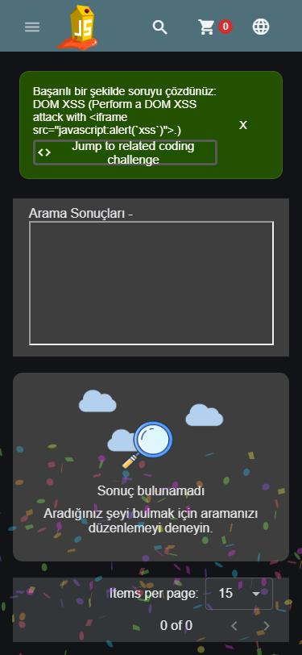

> **Örnek bulgu / Example finding** — Rapor formatını ekibe göstermek için AI ile birlikte çözülüp yazıldı; Alper adına bırakıldı.
> Written together with AI as a worked example of the report format, kept under Alper's name.

## Summary
The product search reflects the `q` value into the page without sanitising it, so an attacker-supplied
HTML/JavaScript payload runs in the victim's browser. This is a DOM-based cross-site scripting (XSS) issue.

## Attack concept
The Angular front end reads the search term from the URL and writes it into the "Search Results" heading
using an unsafe binding (`innerHTML`). Because the value is treated as HTML instead of text, markup such as
an `<iframe>` with a `javascript:` URL is inserted into the DOM and executed. An attacker who gets a victim
to open a crafted search link runs script in the victim's session (session theft, actions on their behalf).

## Steps to reproduce
1. Start Juice Shop locally (`docker compose up -d`) and open http://127.0.0.1:3000
2. Click the magnifying-glass icon in the top bar to open the search box.
3. Enter the payload below and press Enter (or open the crafted URL directly):

```
<iframe src="javascript:alert(`xss`)">
```

Direct URL form:
```
http://127.0.0.1:3000/#/search?q=<iframe src="javascript:alert(`xss`)">
```

4. The browser executes the script and shows an `xss` alert; Juice Shop confirms the "DOM XSS" challenge is solved.

## Evidence


## Impact
Script chosen by the attacker runs in the victim's browser in the context of the Juice Shop origin. It can
read the victim's session token from local storage, perform actions as the victim, or redirect them to a
phishing page. Confidentiality and integrity are rated Low individually, but scope is Changed because the
injected script escapes the vulnerable component and acts on the whole authenticated session. Delivery needs
the victim to open a crafted link (User Interaction: Required), which is why this is Medium rather than High.

## Detection
- Manual: submit an HTML payload (e.g. `` or the `<iframe>` above) in the search
  field and observe whether it renders as markup instead of plain text.
- Code review: look for values bound with `innerHTML` / `[innerHTML]` or `bypassSecurityTrust*` instead of
  text interpolation.

## Mitigation
- Render user input as text, not HTML. In Angular use interpolation (`{{ q }}`) or property binding to
  `textContent`; never assign untrusted input to `innerHTML`.
- Do not call `DomSanitizer.bypassSecurityTrustHtml()` on user-controlled data.
- Add a Content-Security-Policy that forbids inline script as defence in depth.
- Reference: [OWASP XSS Prevention Cheat Sheet](https://cheatsheetseries.owasp.org/cheatsheets/Cross_Site_Scripting_Prevention_Cheat_Sheet.html),
  [OWASP DOM based XSS Prevention Cheat Sheet](https://cheatsheetseries.owasp.org/cheatsheets/DOM_based_XSS_Prevention_Cheat_Sheet.html)

## References
- OWASP Top 10:2025 — A05 Injection
- CWE-79: Improper Neutralization of Input During Web Page Generation (Cross-site Scripting)
